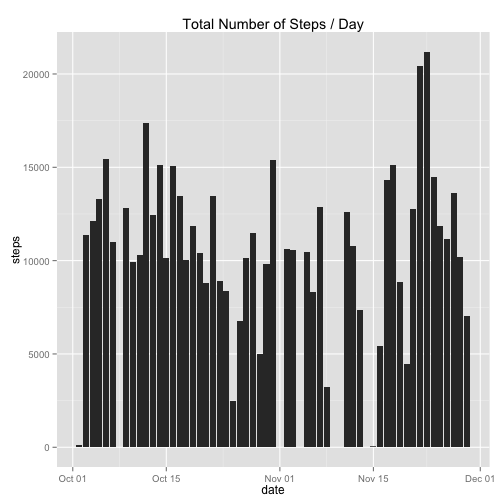
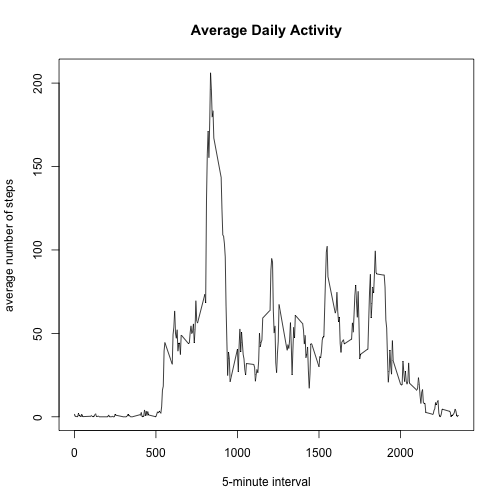
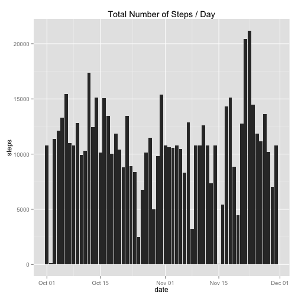
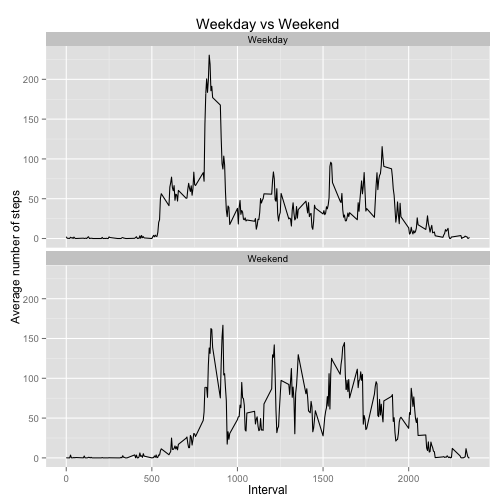

## Loading and preprocessing the data

To load the data, "read.csv" is used and specify the "NA" as not availble value. The data type of "date" is character, hence it requires to converted as "Date" as "yyyy-mm-dd" format. This will assist on further date processing, i.e., identifying weekday and weekend.


```r
act <- read.csv("activity.csv", na.strings = "NA")
act$date <- as.Date(act$date)
```

## What is mean total number of steps taken per day?

To make a histogram of the total number of steps taken each day, qplot from ggplot2 package is used and it actually a bar plot instead of histogram since we need to measure the total number of steps, not the frequency. At this stage, missing value is ignored by using "na.rm = TRUE"


```r
library(ggplot2)
aggsteps <- aggregate(steps ~ date, act, sum, na.rm = TRUE)
p <- qplot(x = date, y = steps, data = aggsteps, geom = "bar", stat = "identity", position = "dodge")
p + labs(title = "Total Number of Steps / Day")
```

 
  
The __mean__ and __median__ total number of steps are processed as below. The median numbers are all zero because most intervals during the day are having 0 steps.  

```r
mean <- aggregate(steps ~ date, act, mean, na.rm = TRUE)
```

```
## Error in get(as.character(FUN), mode = "function", envir = envir): object 'FUN' of mode 'function' was not found
```

```r
colnames(mean)[2] <- "mean"
median <- aggregate(steps ~ date, act, median, na.rm = TRUE)
```

```
## Error in get(as.character(FUN), mode = "function", envir = envir): object 'FUN' of mode 'function' was not found
```

```r
colnames(median)[2] <- "median"
mm <- merge(mean, median, by = "date")
mm
```

```
##          date       mean median
## 1  2012-10-02  0.4375000      0
## 2  2012-10-03 39.4166667      0
## 3  2012-10-04 42.0694444      0
## 4  2012-10-05 46.1597222      0
## 5  2012-10-06 53.5416667      0
## 6  2012-10-07 38.2465278      0
## 7  2012-10-09 44.4826389      0
## 8  2012-10-10 34.3750000      0
## 9  2012-10-11 35.7777778      0
## 10 2012-10-12 60.3541667      0
## 11 2012-10-13 43.1458333      0
## 12 2012-10-14 52.4236111      0
## 13 2012-10-15 35.2048611      0
## 14 2012-10-16 52.3750000      0
## 15 2012-10-17 46.7083333      0
## 16 2012-10-18 34.9166667      0
## 17 2012-10-19 41.0729167      0
## 18 2012-10-20 36.0937500      0
## 19 2012-10-21 30.6284722      0
## 20 2012-10-22 46.7361111      0
## 21 2012-10-23 30.9652778      0
## 22 2012-10-24 29.0104167      0
## 23 2012-10-25  8.6527778      0
## 24 2012-10-26 23.5347222      0
## 25 2012-10-27 35.1354167      0
## 26 2012-10-28 39.7847222      0
## 27 2012-10-29 17.4236111      0
## 28 2012-10-30 34.0937500      0
## 29 2012-10-31 53.5208333      0
## 30 2012-11-02 36.8055556      0
## 31 2012-11-03 36.7048611      0
## 32 2012-11-05 36.2465278      0
## 33 2012-11-06 28.9375000      0
## 34 2012-11-07 44.7326389      0
## 35 2012-11-08 11.1770833      0
## 36 2012-11-11 43.7777778      0
## 37 2012-11-12 37.3784722      0
## 38 2012-11-13 25.4722222      0
## 39 2012-11-15  0.1423611      0
## 40 2012-11-16 18.8923611      0
## 41 2012-11-17 49.7881944      0
## 42 2012-11-18 52.4652778      0
## 43 2012-11-19 30.6979167      0
## 44 2012-11-20 15.5277778      0
## 45 2012-11-21 44.3993056      0
## 46 2012-11-22 70.9270833      0
## 47 2012-11-23 73.5902778      0
## 48 2012-11-24 50.2708333      0
## 49 2012-11-25 41.0902778      0
## 50 2012-11-26 38.7569444      0
## 51 2012-11-27 47.3819444      0
## 52 2012-11-28 35.3576389      0
## 53 2012-11-29 24.4687500      0
```

## What is the average daily activity pattern?

The average daily activity pattern can be describerd via below time series plot.

```r
avg5min <- aggregate(steps ~ interval, act, FUN = "mean", na.rm = TRUE)
plot(avg5min$interval, avg5min$steps, type = "l", xlab = "5-minute interval", ylab = "average number of steps", main = "Average Daily Activity")
```

 
  
The activities are very quiet between midnight and 5am. Once passed 5am, the average of steps are hiking up and reach the peak at 0835. 

```r
avg5min[which.max(avg5min$steps),]
```

```
##     interval    steps
## 104      835 206.1698
```
  
The average remains high but starts dropping and falls to the bottom before 1000. After 1000, the average steps fluctuate gradually between 100 and 20 until 2000. And the average steps decline and reach nearly 0 before midnight.

## Imputing missing values

In previous analyses, missing valuea, i.e., NA, are ignored to void possible bias or misleading interpretation. There are total 2304 rows with missing values in steps out of total 17568 observations.

```r
nrow(subset(act, is.na(steps)))
```

```
## [1] 2304
```
  
To impute missing value, a simple strategy is adopted to replace NA with the mean for that 5-minute interval.

```r
missing <- subset(act, is.na(steps))
missing$steps <- replace(missing$steps, missing$interval %in% avg5min$interval, avg5min$steps)
```
  
A new dataset _act.nona_ is created from orignal dataset _act_ but with the missing data filled from the mean for that 5-minute interval.


```r
act.nona <- act
act.nona$steps <- replace(act.nona$steps, act$date %in% missing$date & act$interval %in% missing$interval, missing$steps)
```
  
After imputng missing values, a new histogram of the total number of steps taken each day is create below.

```r
aggsteps.nona <- aggregate(steps ~ date, act.nona, sum, na.rm = TRUE)
p <- qplot(x = date, y = steps, data = aggsteps.nona, geom = "bar", stat = "identity", position = "dodge")
p + labs(title = "Total Number of Steps / Day")
```

 
  
Compred to the first histogram, there are 8 days with no data and now they are visable in this plot. Since the missing data are filled from the mean for that 5-minute interval, identical total numbers are presented for those days. The overall picture of these two histogram plots look similar except the days with filled data.  

However, the new __mean__ and __median__ look different, and the main reason is from the 8 days of new filled data. They are 1/10, 8/10, 1/11, 4/11, 9/11, 10/11, 14/11, 30/11. The mean is 37.38 and the median is 34.11 while 53 observations increase to 61. The filled missing values did not impact exisiting data but the analysis more complete.


```r
mean.nona <- aggregate(steps ~ date, act.nona, FUN = "mean", na.rm = TRUE)
colnames(mean.nona)[2] <- "mean"
median.nona <- aggregate(steps ~ date, act.nona, FUN = "median", na.rm = TRUE)
colnames(median.nona)[2] <- "median"
mm.nona <- merge(mean.nona, median.nona, by = "date")
mm.nona
```

```
##          date       mean   median
## 1  2012-10-01 37.3825996 34.11321
## 2  2012-10-02  0.4375000  0.00000
## 3  2012-10-03 39.4166667  0.00000
## 4  2012-10-04 42.0694444  0.00000
## 5  2012-10-05 46.1597222  0.00000
## 6  2012-10-06 53.5416667  0.00000
## 7  2012-10-07 38.2465278  0.00000
## 8  2012-10-08 37.3825996 34.11321
## 9  2012-10-09 44.4826389  0.00000
## 10 2012-10-10 34.3750000  0.00000
## 11 2012-10-11 35.7777778  0.00000
## 12 2012-10-12 60.3541667  0.00000
## 13 2012-10-13 43.1458333  0.00000
## 14 2012-10-14 52.4236111  0.00000
## 15 2012-10-15 35.2048611  0.00000
## 16 2012-10-16 52.3750000  0.00000
## 17 2012-10-17 46.7083333  0.00000
## 18 2012-10-18 34.9166667  0.00000
## 19 2012-10-19 41.0729167  0.00000
## 20 2012-10-20 36.0937500  0.00000
## 21 2012-10-21 30.6284722  0.00000
## 22 2012-10-22 46.7361111  0.00000
## 23 2012-10-23 30.9652778  0.00000
## 24 2012-10-24 29.0104167  0.00000
## 25 2012-10-25  8.6527778  0.00000
## 26 2012-10-26 23.5347222  0.00000
## 27 2012-10-27 35.1354167  0.00000
## 28 2012-10-28 39.7847222  0.00000
## 29 2012-10-29 17.4236111  0.00000
## 30 2012-10-30 34.0937500  0.00000
## 31 2012-10-31 53.5208333  0.00000
## 32 2012-11-01 37.3825996 34.11321
## 33 2012-11-02 36.8055556  0.00000
## 34 2012-11-03 36.7048611  0.00000
## 35 2012-11-04 37.3825996 34.11321
## 36 2012-11-05 36.2465278  0.00000
## 37 2012-11-06 28.9375000  0.00000
## 38 2012-11-07 44.7326389  0.00000
## 39 2012-11-08 11.1770833  0.00000
## 40 2012-11-09 37.3825996 34.11321
## 41 2012-11-10 37.3825996 34.11321
## 42 2012-11-11 43.7777778  0.00000
## 43 2012-11-12 37.3784722  0.00000
## 44 2012-11-13 25.4722222  0.00000
## 45 2012-11-14 37.3825996 34.11321
## 46 2012-11-15  0.1423611  0.00000
## 47 2012-11-16 18.8923611  0.00000
## 48 2012-11-17 49.7881944  0.00000
## 49 2012-11-18 52.4652778  0.00000
## 50 2012-11-19 30.6979167  0.00000
## 51 2012-11-20 15.5277778  0.00000
## 52 2012-11-21 44.3993056  0.00000
## 53 2012-11-22 70.9270833  0.00000
## 54 2012-11-23 73.5902778  0.00000
## 55 2012-11-24 50.2708333  0.00000
## 56 2012-11-25 41.0902778  0.00000
## 57 2012-11-26 38.7569444  0.00000
## 58 2012-11-27 47.3819444  0.00000
## 59 2012-11-28 35.3576389  0.00000
## 60 2012-11-29 24.4687500  0.00000
## 61 2012-11-30 37.3825996 34.11321
```

## Are there differences in activity patterns between weekdays and weekends?

Based on data will filled-in missing values, a new factor variable "days" with two levels "weekday" and "weekend", is created in the dataset act.week which is identical to act.nona.

```r
act.week <- act.nona
act.week$days <- ifelse(weekdays(act.week$date) %in% c("Saturday","Sunday"), "Weekend", "Weekday")
```
  
A panel plot containing a time series plot of the 5-minute interval and the average number of steps taken, averaged across all weekdays or weekend days, is created below.

```r
avg5min <- aggregate(steps ~ interval + days, act.week, FUN = "mean")
p <- qplot(interval, steps, data = avg5min, geom = "line", xlab = "Interval", ylab = "Average number of steps")
p + facet_wrap(~ days, nrow = 2) + labs(title = "Weekday vs Weekend")
```

 

In weekday, the time series trend is very similar to the average daily activity plot in part two. Activities are quiet between midnight and 5am, then number of steps start hinking and reach peak at 0835. The average number of steps fluctuate after 1000 and get declined since 1900 until end of day.

In weekend, the trend before 5am is similar to weekday and gradually increases afterwards before reaching the peak at 0845. Compared to weekday, the peak is much lower but the fluctuation is larger and longer. Also, the continuous decline of average happens after 2000, later than weekday.
